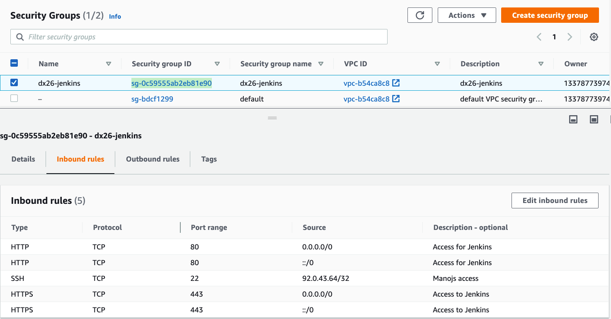
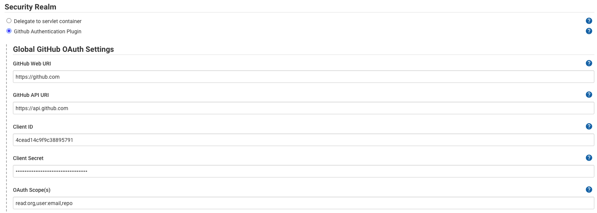
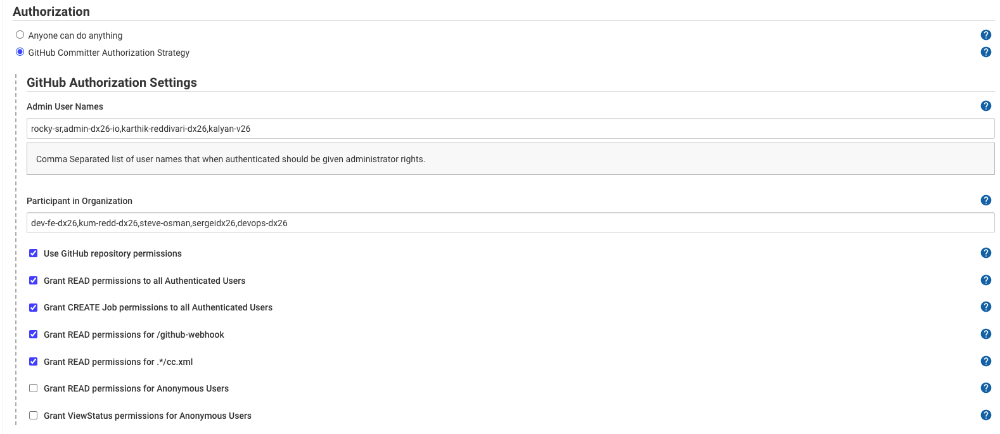

# Setting up Jenkins infrastructure from scratch

* Configure your CLI to have the right credentials. (I had to use aws CLI crednetials based on a user, but its prefered to use a role based sts token)
  
* Create a Key Pair and secure it by storing it in a safe place. Also change the permissions to 400
```sh
╭─reddys@believe.become ~/documents/dev/dx26.io/dx26-ci-cd
╰─➤  chmod 400 dx26-jenkins.pem
```

* Create an Elastic IP which can be attached to the jenkins instance

* Create a security group which needs to be attached to the Jenkins instance. This security group should have the following rules



* Create a volume of size 50GB(min) with storage class as GP3 with throughput of 3000 IOPS and bandwidth of 125 MB/s. These specification fall under the free tier. Also, ensure you enable encryption and pick the default key which AWS provides


* Create an AWS EC2 instance role which can be used by the instance as an instance profile. Give aws S3 full permissions to start with, so that we can tailor it at a lator point in time.


* Launch an instance to create an AMI which can be used for launching Jenkins. Use the config in the following section


Also make sure you use the Key Pair you have created earlier. This will let us SSH onto the instance to configure Jenkins deamon

* Associate the Elastic IP to this instance

* SSH onto the instance and start patching the system and installing jenkins

```sh
╭─reddys@believe.become ~/documents/dev/dx26.io/dx26-ci-cd
╰─➤  ssh -i dx26-jenkins.pem ec2-user@3.87.2.58
The authenticity of host '3.87.2.58 (3.87.2.58)' can't be established.
ECDSA key fingerprint is SHA256:pnPx0qD86q/wKIB+/a61dXlibp0zTOvq4NatVvEM+6w.
Are you sure you want to continue connecting (yes/no/[fingerprint])? yes
Warning: Permanently added '3.87.2.58' (ECDSA) to the list of known hosts.

       __|  __|_  )
       _|  (     /   Amazon Linux 2 AMI
      ___|\___|___|

https://aws.amazon.com/amazon-linux-2/
[ec2-user@ip-172-31-95-115 ~]$
```

* Patching the system and installing Jenkins
  
```sh
[ec2-user@ip-172-31-95-115 ~]$ sudo yum check-update
Loaded plugins: extras_suggestions, langpacks, priorities, update-motd
[ec2-user@ip-172-31-95-115 ~]$ sudo wget -O /etc/yum.repos.d/jenkins.repo \
     https://pkg.jenkins.io/redhat-stable/jenkins.repo
--2021-05-15 10:57:34--  https://pkg.jenkins.io/redhat-stable/jenkins.repo
Resolving pkg.jenkins.io (pkg.jenkins.io)... 199.232.66.133, 2a04:4e42:2f::645
Connecting to pkg.jenkins.io (pkg.jenkins.io)|199.232.66.133|:443... connected.
HTTP request sent, awaiting response... 200 OK
Length: 85
Saving to: ‘/etc/yum.repos.d/jenkins.repo’

100%[=======================================================>] 85          --.-K/s   in 0s

2021-05-15 10:57:34 (5.78 MB/s) - ‘/etc/yum.repos.d/jenkins.repo’ saved [85/85]

[ec2-user@ip-172-31-95-115 ~]$ sudo rpm --import https://pkg.jenkins.io/redhat-stable/jenkins.io.key
[ec2-user@ip-172-31-95-115 ~]$ sudo yum upgrade
Loaded plugins: extras_suggestions, langpacks, priorities, update-motd
jenkins                                                                   | 2.9 kB  00:00:00
jenkins/primary_db                                                        |  37 kB  00:00:00
No packages marked for update
[ec2-user@ip-172-31-95-115 ~]$ sudo yum install jenkins java-1.8.0-openjdk-devel -y
........ Once done installing
[ec2-user@ip-172-31-95-115 ~]$ sudo systemctl daemon-reload
```

* Starting Jenkins as a service

```sh
[ec2-user@ip-172-31-95-115 ~]$ sudo systemctl start jenkins

[ec2-user@ip-172-31-95-115 ~]$ sudo systemctl status jenkins
```

* Other packages
```sh
sudo yum install git
sudo yum install maven
```

* Install Docker
```sh
sudo amazon-linux-extras install docker
sudo service docker start
sudo usermod -a -G docker ec2-user
sudo usermod -a -G docker jenkins
sudo chkconfig docker on
sudo chmod 776 /var/run/docker.sock
```

* Jenkins runs on port 8080 by default. lets route the traffic from port 80 to 8080

```sh
[ec2-user@ip-172-31-95-115 ~]$ sudo iptables -A PREROUTING -t nat -i eth0 -p tcp --dport 80 -j REDIRECT --to-port 8080

[ec2-user@ip-172-31-95-115 ~]$ sudo iptables --table nat --list
Chain PREROUTING (policy ACCEPT)
target     prot opt source               destination
REDIRECT   tcp  --  anywhere             anywhere             tcp dpt:http redir ports 8080

Chain INPUT (policy ACCEPT)
target     prot opt source               destination

Chain OUTPUT (policy ACCEPT)
target     prot opt source               destination

Chain POSTROUTING (policy ACCEPT)
target     prot opt source               destination
```

* Configure Jenkins, by loggining in and creating a user with some admin credentials
* Install all necessary plugins and let it restart
* Install Github Authenticator
* Configure Github OAuth App for the org
* Configure secrets in global security in github





* At this point you no longer can use the admin credentials. All authn and authz will work out through github.

* At this point Jenkins should be running as expected and we can take an image out of this. For this lets stop Jenkins first and then create an image out of it.
  
* Create an IAM policy with the following config
  
```json
{
    "Version": "2012-10-17",
    "Statement": [
        {
            "Effect": "Allow",
            "Action": [
                "ec2:DescribeAddresses",
                "ec2:AllocateAddress",
                "ec2:DescribeInstances",
                "ec2:AssociateAddress"
            ],
            "Resource": "*"
        }
    ]
}
```

Once done, attach this policy to the role we created earlier. This will give the EC2 instance the permissions to associate IP addresses on start up.

* create a bashscript in the `/usr/local/bin` which will be run during start up of the instance
  


> Notes:
> * Ensure all resources created are tagged as appropriate
> * Admin Credentials: Username: dx26admin; Password: @khtn2020C2L
> * Delete `iptable` rules created above by running the command `sudo iptables -t nat -F`
> * Admin users: rocky-sr,admin-dx26-io,karthik-reddivari-dx26,kalyan-v26
> * Other users: dev-fe-dx26,kum-redd-dx26,steve-osman,sergeidx26,devops-dx26
> * Oauth Secret: 5316219d9594b564a7bb96787ba2cf64cb160dfa
